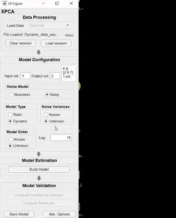
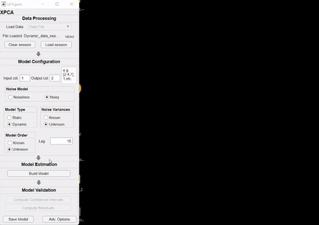
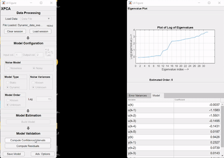

<!-- PROJECT LOGO -->
<br />
<div align="center">
  <a href="https://github.com/ranjeetsn/XPCA_MATLAB_APP">
    
  </a>

  <h3 align="center">XPCA Application MATLAB</h3>

  <p align="center">
    An awesome application to model dynamic and static processes!
    <br />
    <a href="https://github.com/ranjeetsn/XPCA_MATLAB_APP"><strong>Explore the docs »</strong></a>
    <br />
    <br />
    <a href="https://github.com/ranjeetsn/XPCA_MATLAB_APP">View Demo</a>
    ·
    <a href="https://github.com/ranjeetsn/XPCA_MATLAB_APP/issues">Report Bug</a>
    ·
    <a href="https://github.com/ranjeetsn/XPCA_MATLAB_APP/issues">Request Feature</a>
  </p>
</div>


<!-- TABLE OF CONTENTS -->
<details>
  <summary>Table of Contents</summary>
  <ol>
    <li>
      <a href="#about-the-project">About The Project</a>
      <ul>
        <li><a href="#built-with">Built With</a></li>
      </ul>
    </li>
    <li>
      <a href="#getting-started">Getting Started</a>
      <ul>
        <li><a href="#prerequisites">Prerequisites</a></li>
        <li><a href="#installation">Installation</a></li>
      </ul>
    </li>
    <li><a href="#usage">Usage</a></li>
    <li><a href="#roadmap">Roadmap</a></li>
    <li><a href="#contributing">Contributing</a></li>
    <li><a href="#license">License</a></li>
    <li><a href="#contact">Contact</a></li>
    <li><a href="#acknowledgments">Acknowledgments</a></li>
  </ol>
</details>


<!-- ABOUT THE PROJECT -->
## About The Project
[![Product Name Screen Shot][product-screenshot]]()

The XPCA Application, the first of its kind on this platform, is designed primarily for classroom training, academic purposes, Industrial and Commercial Applications. The Toolbox contains options for constructing mathematical data-driven models for Error-in-Variable (EIV) linear-time invariant (LTI) systems for Dynamic Models from measured input-output data as well as Static Models for heteroskedastic error variables. In the present version of the App Toolbox the class of systems are restricted to Single Input Single Output (SISO) Dynamic Systems. The Toolbox is also useful for model validation using bootstrapping for confidence interval calculation and residual analysis using EIV Kalman filter. The App Toolbox has been designed for Novice and Expert User to Estimate and Validate models using multiple options and methods. The Backend of the App Toolbox has been designed in the "Strategic pattern" and "Singleton pattern" such that future developers can plug new options and methods very easily without disturbing the integrity of other components in the Application.

To summarise:
* Model Dynamic and Static processes for EIV data
* Currently only supports SISO dynamic systems
* Uses EIV Kalman Filter for validation and Prediction
* Uses Strategic Pattern architecture

<p align="right">(<a href="#readme-top">back to top</a>)</p>


### Built With
The Application was build on the MATLAB plaform, the User interface was designed was MATLAB App designer as well as on MATLAB GUIDE

* [![Matlab][Matlab.com]][Matlab-url]
* [![Matlab][MatlabApp.com]][MatlabApp-url]
* [![Matlab][Matlabguide.com]][Matlabguide-url]

<p align="right">(<a href="#readme-top">back to top</a>)</p>


<!-- GETTING STARTED -->
## Getting Started


### Prerequisites

To run MATLAB Application the user must have MATLAB installed on their device

* MATLAB
  https://in.mathworks.com/help/install/install-products.html

### Installation

1. Clone the XPCA App repository 
   ```sh
   git clone https://github.com/ranjeetsn/XPCA_MATLAB_APP
   ```

<p align="right">(<a href="#readme-top">back to top</a>)</p>


<!-- USAGE EXAMPLES -->
## Usage

* Data
  * Loading Data
    1. [.mat file](https://www.mathworks.com/help/matlab/import_export/mat-file-versions.html)
    2. [Matlab time series object](https://www.mathworks.com/help/matlab/ref/timeseries.html)
   
  * Data dimensions
    1. Check data dimensions below the load data component
    <br>
    
    </br>
    
* Model configurations
  * Input and Output column (Inputs)
    1. If the user loads the data as a `.mat` file, the user inputs the input column or the output column in the .mat file, eg.
       ```sh
       input col.: [1,2,3] output col.: [4:5], # .mat Data file has inputs in column 1,2,3 and outputs in column 4,5
       ```
    2. For `MATLAB Time Series object` the inputs and output columns are readily extracted without any user inputs

   * Noise Model (radio button)
     1. Choose Static for Static process
     2. Choose Dynamic for Dynamic process (Please note app currently supports SISO dynamic processes only)

   * Noise Variances (radio button)
     1. If the user knows the variance of input and output variables the user must choose `Known`. The app then prompts the user to input the variances in the     advanced options section.
     2. The user can choose to have `Unknown` variances then the algorithm calculates the variance of the variables.

   * Model Order (radio button)
     1. If the user knows the order of model the user must choose `Known`. The app then prompts the user to input the order in the advanced options section.
     2. The user can choose to have `Unknown` order then the algorithm calculates the order of the variable.

         

    * Lag (Inputs)
      1. For Dynamic processes the application prompts the user to give an upper bound to the order of the model which is defined as lag. The default value of the lag is 15 that means the order of the model must be less than 15. To read more on order please refer [here](https://www.me.psu.edu/cimbala/me345/Lectures/Dynamic_systems.pdf).

* Model Estimation
    * Build Model (Button)
      1. To build model for Dynamic or Static process the user must press the button. It will open up a pop-up showing the log of eigenvalues vs assumed lag plot, along with the order of the model either calculated or as inserted by the user
      2. The pop up will also show the variance of the variables as well as the model coefficients as shown in the gif below:
      
      
      
* Model Validation
    * Compute Confidence Interval (Button)
      1. When the user presses Compute Confidence Interval button the user is prompted to change the variable for computing confidence interval of the model coefficients.
      2. The parameters are for the bootstrap models in the Advanced Options - Model Validation. Here the user chooses the size of the Bootstraps model, the user must take care that the size of the bootstrap is less than length of data, the number of bootstraps, the higher the number of bootstraps the better the accuracy of the bootstrap but it also slows down the application, confidence interval percentage(CI significance) of the bootstrap, which constructs the interval depending on the CI significance value. If the Confidence interval for the coefficient contains zero it implies the model coefficient is insignificant.
    * Compute Residuals (Button)
      1. To check for whiteness of the data residuals we use the EIV Kalman filter. If the residuals are white then all the maximum possible information from the data has been extracted and no more information can be extracted from the data.
      
      
    
* Model comparison (feature only supported for dynamic models)
    * Cross Validate (Button)
      1. After pressing the button a pop-up prompts the user which contains for model comparison with data and the predicted data (currently this feature is only supported for the dynamic processes)
      2. The user must load the data for comparison in the pop-up
      
      
      
    * Model Comparison (Button)
      1. After pressing the button a pop-up prompts the user to compare the XPCA model to other models for a dataset. The user can load many models for comparison and can also load multiple datas (the user can only compare one data at a time however can compare multiple models)
      2. The user must load the data sets and the model for comparison in the pop-up
      
      
    

<p align="right">(<a href="#readme-top">back to top</a>)</p>


<!-- ROADMAP -->
## Roadmap

- [x] Add IPCA model
- [x] Add DIPCA SISO model
- [x] Kalman Validation and Prediction
- [x] Model comparison
- [ ] Add pre-processing section
  - [ ]  Stationarity tests ADF or KPSS test (another pop up needed)
  - [ ]  Normalization of input data
  - [ ]  Suggestions from open issues
- [ ] Add OE and MIMO models
- [ ] Add Additional Templates w/ Examples

<p align="right">(<a href="#readme-top">back to top</a>)</p>


<!-- LICENSE -->
## License

Distributed under the MIT License. See `LICENSE.txt` for more information.

<p align="right">(<a href="#readme-top">back to top</a>)</p>


<!-- CONTACT -->
## Contact

Ranjeet Nagarkar - [@RanjeetNagarka2](https://twitter.com/RanjeetNagarka2) - ranjeet.sn96@gmail.com

Project Link: [https://github.com/ranjeetsn/XPCA_MATLAB_APP](https://github.com/ranjeetsn/XPCA_MATLAB_APP)

<p align="right">(<a href="#readme-top">back to top</a>)</p>


<!-- ACKNOWLEDGMENTS -->
## Acknowledgments

Use this space to list resources you find helpful and would like to give credit to. I've included a few of my favorites to kick things off!


<!-- MARKDOWN LINKS & IMAGES -->
<!-- https://www.markdownguide.org/basic-syntax/#reference-style-links -->
[contributors-shield]: https://img.shields.io/github/contributors/othneildrew/Best-README-Template.svg?style=for-the-badge
[contributors-url]: https://github.com/othneildrew/Best-README-Template/graphs/contributors
[forks-shield]: https://img.shields.io/github/forks/othneildrew/Best-README-Template.svg?style=for-the-badge
[forks-url]: https://github.com/othneildrew/Best-README-Template/network/members
[stars-shield]: https://img.shields.io/github/stars/othneildrew/Best-README-Template.svg?style=for-the-badge
[stars-url]: https://github.com/othneildrew/Best-README-Template/stargazers
[issues-shield]: https://img.shields.io/github/issues/othneildrew/Best-README-Template.svg?style=for-the-badge
[issues-url]: https://github.com/othneildrew/Best-README-Template/issues
[license-shield]: https://img.shields.io/github/license/othneildrew/Best-README-Template.svg?style=for-the-badge
[license-url]: https://github.com/othneildrew/Best-README-Template/blob/master/LICENSE.txt
[linkedin-shield]: https://img.shields.io/badge/-LinkedIn-black.svg?style=for-the-badge&logo=linkedin&colorB=555
[linkedin-url]: https://linkedin.com/in/othneildrew
[product-screenshot]: readme_files/XPCA_screenshot.jpg
[Matlab.com]: https://img.shields.io/badge/M-MATLAB-orange
[Matlab-url]: https://in.mathworks.com/products/matlab.html
[MatlabApp.com]: https://img.shields.io/badge/M-MATLAB%20App%20designer-orange
[MatlabApp-url]: https://in.mathworks.com/products/matlab/app-designer.html
[Matlabguide.com]: https://img.shields.io/badge/M-MATLAB%20GUIDE-orange
[Matlabguide-url]: https://in.mathworks.com/help/matlab/migrate-guide-apps.html
[Datadimensions]: readme_files/Data_info.jpg
